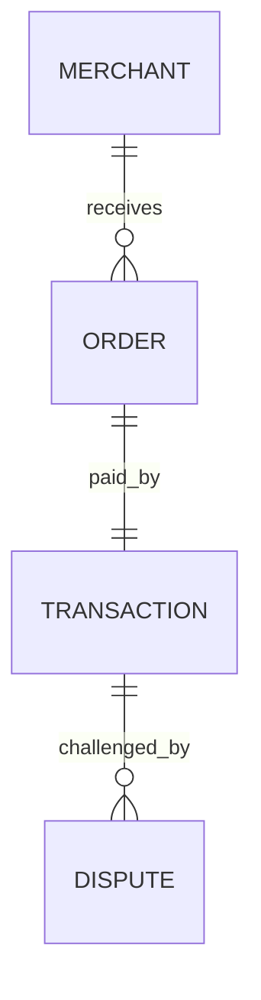
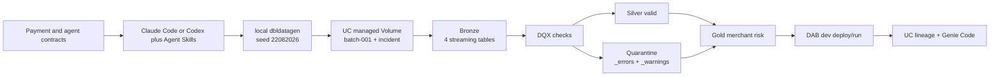

# DBX Agentic Development — workshop-readiness plan

Status: approved and locally implemented; Free Edition rehearsal pending. The seven-entity
advanced reference described in this plan was later removed from the repository.

Workshop: Saturday, 22 August 2026, 09:00–13:00 America/Sao_Paulo

Implementation target: Databricks Free Edition, `dev` only

Instructor host: `https://dbc-ec01047b-2f32.cloud.databricks.com`

## 1. Executive decision

Build a root-integrated workshop vertical slice using the repository's existing `configs/`, `gen/`, `pipelines/`, `data/`, and `docs/` domains, while retaining the current seven-entity, 22-resource PSP implementation as the advanced reference solution.

The four-hour learner story is deliberately narrow:

> A payment platform receives a suspicious merchant incident. Learners use an agent contract and Databricks Agent Skills to generate deterministic data, ingest it through one serverless Lakeflow pipeline, preserve bad rows with DQX, observe a late valid chargeback change merchant risk, deploy with DABs, and investigate the result with Genie Code.

The simplification removes infrastructure choices and production breadth, not advertised outcomes:

- four entities: merchants, orders, transactions, disputes;
- one Unity Catalog catalog and one learner schema;
- one managed Volume;
- one serverless Lakeflow pipeline;
- one visible CLI sequence for generation, Volume upload, and pipeline refresh;
- one Gold materialized view, `gold_merchant_risk`;
- one deterministic incident with eight named conditions;
- one `dev` target and one reset command.

The instructor workspace is the canonical rehearsal and replay environment. It must not be the shared execution workspace for the room. Databricks Free Edition permits only one active pipeline per pipeline type and one workspace/metastore per account, so every learner or pair must create and authenticate to their own Free Edition workspace. The instructor URL is used in the runbook and recorded evidence, not hard-coded as the learner host. See [Free Edition limitations](https://docs.databricks.com/aws/en/getting-started/free-edition-limitations) and [Free Edition signup](https://docs.databricks.com/aws/en/getting-started/free-edition).

## 2. What the research established

### Confirmed current facts

- Free Edition is serverless-only, includes default storage, and supports pipeline development and Genie Code. It has fair-use quotas, one SQL warehouse, five concurrent job tasks, and one active pipeline per pipeline type. It has no SLA. [Free Edition](https://docs.databricks.com/aws/en/getting-started/free-edition), [limitations](https://docs.databricks.com/aws/en/getting-started/free-edition-limitations)
- Lakeflow pipelines use `from pyspark import pipelines as dp`. Open-source SDP starts in Spark 4.1; the current Apache Spark release and PyPI `pyspark` package are 4.2.0. The local CLI is installed with `pyspark[pipelines]`. [Apache Spark SDP guide](https://spark.apache.org/docs/latest/declarative-pipelines-programming-guide.html)
- Current Lakeflow pipeline environment versions are 3 and 4; this feature is Beta and changes execution to Spark Connect. Pin environment version 4 and test it instead of inheriting a moving default. [Pipeline environments](https://docs.databricks.com/aws/en/ldp/developer/environment-versions)
- Databricks recommends Unity Catalog for Lakeflow pipelines, and serverless pipelines support Python dependencies through the pipeline environment. [Unity Catalog with pipelines](https://docs.databricks.com/aws/en/ldp/unity-catalog), [serverless pipelines](https://docs.databricks.com/aws/en/ldp/serverless)
- The latest Databricks CLI release is v1.13.0, published 20 August 2026. The installed local CLI is v1.2.1 and must be upgraded before rehearsal. [Databricks CLI v1.13.0](https://github.com/databricks/cli/releases/tag/v1.13.0)
- Databricks Agent Skills are installed by the CLI. Project scope and explicit Claude Code/Codex targeting are supported. The currently visible catalog is v0.2.10 and none of its 32 skills is installed in this repository. [AI tools command](https://docs.databricks.com/aws/en/dev-tools/cli/reference/aitools-commands), [Agent Skills repository](https://github.com/databricks/databricks-agent-skills)
- DQX v0.16.0 is current and explicitly supports Lakeflow pipeline summary metrics. It includes breaking changes, so the workshop must pin and smoke-test it. [DQX v0.16.0](https://github.com/databrickslabs/dqx/releases/tag/v0.16.0), [DQX motivation](https://databrickslabs.github.io/dqx/docs/motivation/)
- `dbldatagen` 0.4.0.post1 is the current PyPI package, and its latest release asset is a serverless hotfix wheel. It predates Spark 4.2, so Spark 4.2/serverless compatibility is an explicit P0 spike, not an assumption. [dbldatagen releases](https://github.com/databrickslabs/dbldatagen/releases), [dbldatagen project](https://github.com/databrickslabs/dbldatagen)

### Direct evidence, inference, proposal

This table records the pre-implementation research snapshot; the current implementation evidence is under
`docs/rehearsals/`.

| Boundary | Statement |
|---|---|
| Direct evidence | The live landing page returns HTTP 200 and promises six modules, 100k transactions, eight incidents, four fallbacks, and six final outcomes. |
| Direct evidence | The current repository is clean on `main`, has 22 pipeline libraries, uses a seven-entity ShadowTraffic design, and has no project `AGENTS.md` or `CLAUDE.md`. |
| Direct evidence | Local tools are Databricks CLI 1.2.1, Claude Code 2.1.238, uv 0.9.25, no `spark-pipelines`, and 0/32 Databricks Agent Skills. |
| Inference | A shared instructor Free Edition workspace cannot support independent learner deployments reliably because of the single-active-pipeline quota. |
| Proposal | Each learner/pair uses a separate Free Edition account; the instructor workspace supplies golden output and replay evidence. |
| Unverified until rehearsal | `dbldatagen==0.4.0.post1` and `databricks-labs-dqx==0.16.0` work together on Free Edition pipeline environment 4. |
| Unverified until workspace preflight | The instructor Free Edition workspace exposes a configurable Genie Space. Genie Code is documented for Free Edition and remains the mandatory landing-page outcome. |

### Research-provider record

- Exa: 44 search results across four workstreams, followed by nine primary-page fetches.
- Tavily: 30 targeted advanced search results plus six page extractions. The first broad `pro` research request timed out after 300 seconds; targeted searches succeeded.
- Firecrawl: 30 developer-index results plus four forced-live scrapes, including structured extraction of the landing-page contract.
- Authority rule: provider results were discovery/evidence inputs. Version and feature claims in this plan use Databricks, Apache Spark, PyPI, and official GitHub repositories as sources of truth.

Normalized provider records are in `docs/plans/evidence/`.

## 3. Landing-page contract

The implementation is not workshop-ready until every row below has inspectable evidence.

| Landing promise | Workshop implementation | Proof |
|---|---|---|
| Spec & Plano | Versioned payment data contract plus machine-readable agent contract; agent begins in plan mode | contract validation and approved plan receipt |
| Databricks Agent Skills | Project-scope installation for Claude Code and Codex | `databricks aitools list --scope project` |
| 100k transactions | Deterministic dbldatagen generator with a fixed seed | manifest row counts and content digests |
| Merchants, orders, transactions, disputes | Four small schemas only | contract and generated files |
| Bronze | Four streaming tables with ingestion metadata | pipeline graph and UC table queries |
| DQX & Silver | Valid Silver rows plus explainable quarantine with `_errors` and `_warnings` | incident assertions and DQX metrics |
| Eight incidents | Seven rejected conditions plus one valid late chargeback replay | exact incident ledger |
| Gold & DABs | `gold_merchant_risk`, strict bundle validation, deploy, and run in `dev` | CLI receipts and table assertions |
| Unity Catalog evidence | One learner schema, managed Volume, lineage, table comments | UC object inventory and screenshots |
| Genie Code | Four rehearsed natural-language investigations over Gold and quarantine | prompt/SQL/result evidence |
| Fallbacks | Pre-generated data, DQX wheel, dry-run replay, recorded queries | fallback checksum and instructor drill |
| Final product | Contract → generator → Lakeflow → DQX → Gold → DAB → Genie | fresh-clone rehearsal receipt |

The landing page says Genie Code, not a learner-created Genie Space. The mandatory module therefore uses Genie Code, which Free Edition documents. If the instructor preflight confirms Genie Spaces, the instructor also configures a small space on `gold_merchant_risk` and demonstrates it; this is additive and cannot block the advertised workshop.

## 4. Learner use case: one merchant-risk incident

### Domain model



Only the fields required for the story are kept:

- merchant: `merchant_id`, `merchant_name`, `country`, `risk_tier`;
- order: `order_id`, `merchant_id`, `order_ts`, `amount_cents`, `currency`;
- transaction: `txn_id`, `order_id`, `merchant_id`, `event_ts`, `amount_cents`, `currency`, `processor`, `status`;
- dispute: `dispute_id`, `txn_id`, `opened_at`, `closed_at`, `reason`, `status`.

### Deterministic batches

`seed=22082026` is fixed in the contract.

| Release | Contents | Purpose |
|---|---|---|
| `batch-001` | 98,791 valid transactions plus supporting merchants, orders, and normal disputes | establish a healthy baseline |
| `batch-002-incident` | 1,209 transactions: 1,204 BRL rows plus five sentinel failures; one invalid temporal dispute; one held valid late chargeback | create seven quarantine causes and one replay event |
| Total | exactly 100,000 transaction rows | satisfy the advertised scale without a large mental model |

The eight incident conditions are:

1. `txn_id` is null;
2. duplicate `txn_id`;
3. `amount_cents <= 0`;
4. BRL is not authorized for this merchant policy (1,204 rows);
5. unknown processor;
6. orphan `order_id`;
7. dispute closes before it opens;
8. a late but valid chargeback arrives during replay and changes the Gold risk score.

The generator writes JSON to a managed Unity Catalog Volume and emits a manifest containing seed, per-entity counts, per-batch counts, incident IDs, SHA-256 digests, and generation timestamp. A checked-in fallback pack contains the exact same logical batches.

## 5. Target architecture



### Workspace layout

- Catalog: default Free Edition `workspace` catalog unless preflight proves a different writable catalog.
- Schema: stable `dbx_agentic_dev` inside each learner's isolated Free Edition workspace. DAB development mode
  still prefixes pipelines per user; the official `skip_name_prefix_for_schema` setting keeps CLI,
  Genie, verification, and reset queries on one teachable namespace.
- Volume: `workspace.dbx_agentic_<user>.landing`.
- Pipeline: `dbx-agentic-psp-<user>-dev`.
- Delivery: local dbldatagen output uploaded to the managed Volume with `databricks fs cp`, then the DAB-managed
  pipeline runs directly.
- Compute: serverless only; no cluster policy, instance pool, Docker, Terraform, service principal, production target, schedule, or email notification.

All learner names derive from the authenticated user. The instructor host is supplied only through the `workshop-instructor` Databricks CLI profile. No org ID, token, or workspace URL is committed into the bundle.

### Medallion contract

Bronze preserves evidence:

- one streaming table per entity;
- raw values retained;
- `_batch_id`, `_source_file`, `_ingested_at`, `_rescued_data`;
- Auto Loader/file stream from the managed Volume;
- no domain rows dropped.

Silver makes DQX the single source of domain-quality behavior:

- rules authored once in `configs/dqx-rules.yaml`;
- valid rows written to `silver_*`;
- invalid rows written to `quarantine_*` with `_errors`, `_warnings`, `_batch_id`, and source metadata;
- no duplicate Lakeflow expectation rules and no `ON VIOLATION DROP ROW` in the workshop path;
- referential checks are deterministic and evaluated against the small parent datasets;
- DQX v0.16.0 summary metrics exposed in the pipeline event evidence if compatible.

The hosted pipeline calls DQX 0.16.0 directly. The local open-source Spark 4.2 runner uses a schema-compatible
annotation projection because DQX currently performs eager schema introspection that the local declarative
query planner rejects. Local results prove the graph and disposition contract; they are not Free Edition DQX
runtime proof.

Gold contains one merchant-grain materialized view:

- approved transaction amount and count;
- dispute and chargeback counts;
- quarantine count and top reasons;
- BRL rejected count;
- last incident time;
- deterministic `risk_score` and `risk_band`;
- a before/after delta for the late valid chargeback.

## 6. Agent contract and skills

The contract has one source and two human-agent projections:

- `configs/contracts/agent-contract.yaml`: canonical permissions, phases, commands, stop conditions, evidence rules, and scope;
- root `AGENTS.md`: vendor-neutral contract for Codex, OpenCode, and other compatible agents;
- root `CLAUDE.md`: Claude Code adapter that imports/references the canonical rules and adds `claude --permission-mode plan` guidance.

Required controls:

- plan-before-edit in Module 1;
- no deployment until the learner approves the plan;
- never read or print credentials;
- only `dev`; no `prd` resources;
- never change the advanced reference pipeline during the workshop;
- use the exact contract fields and incident IDs;
- preserve quarantined rows;
- report local, workspace dry-run, DAB validation, deployment, and runtime evidence separately;
- stop after each checkpoint so learners can compare evidence.

Project-scope skills installation:

```bash
databricks aitools install \
  --scope project \
  --agents claude-code,codex \
  --experimental \
  --skills databricks-core,databricks-dabs,databricks-pipelines,databricks-synthetic-data-gen,databricks-unity-catalog,databricks-spark-structured-streaming,databricks-genie
databricks aitools list --scope project
```

The experimental flag is required only because the current `databricks-genie` skill is experimental. The workshop continues with the stable skills if that one cannot install. Skills are installed locally; Free Edition's serverless outbound-network restriction is not used for this step.

## 7. Pinned toolchain and compatibility gate

“Latest” is a release-time assertion, not an unconstrained dependency range.

| Component | Candidate pin on 21 Aug 2026 | Gate |
|---|---:|---|
| Databricks CLI | `1.13.0` | `databricks version` and DAB schema validation |
| Apache Spark / PySpark SDP | `4.2.0` | `spark-pipelines dry-run` and local run |
| Lakeflow pipeline environment | `4` | remote dry-run and update |
| DQX | `0.16.0` | unit check plus Free Edition pipeline check |
| dbldatagen | `0.4.0.post1` | deterministic local/serverless generation |
| Databricks Agent Skills catalog | observed `0.2.10` | install/list on Claude Code and Codex |
| Python | one version compatible with Spark 4.2 and pipeline env 4 | `uv sync --frozen` |

The P0 compatibility spike must run before implementation continues. If dbldatagen fails on Spark 4.2 or environment 4, test the official serverless hotfix wheel in the instructor workspace. The workshop code must still invoke dbldatagen; pre-generated data is delivery fallback, not a substitute for completing the generator.

## 8. CLI evidence ladder

These commands prove different things and must not be conflated:

```bash
# local dependency and contract proof
uv sync --frozen
uv run pytest -q
./scripts/sdp.sh dry-run --spec pipelines/spark-pipeline.yaml
./scripts/sdp.sh run --spec pipelines/spark-pipeline.yaml --full-refresh-all

# workspace graph proof; no datasets materialized by dry-run
databricks pipelines dry-run workshop_pipeline -t dev -p "$DATABRICKS_CONFIG_PROFILE"

# delivery proof
databricks bundle validate --strict -t dev -p "$DATABRICKS_CONFIG_PROFILE"
databricks bundle deploy -t dev -p "$DATABRICKS_CONFIG_PROFILE"
./scripts/upload_fallback.sh baseline
databricks bundle run workshop_pipeline -t dev -p "$DATABRICKS_CONFIG_PROFILE" --full-refresh-all

# replay proof
./scripts/release_incident.sh --remote
```

The wrapper invokes `uv run spark-pipelines` from the pinned `pyspark[pipelines]` environment after selecting
Java 17/21 and unsetting any global `SPARK_HOME` that could shadow Spark 4.2.

## 9. Four-hour teaching sequence

The schedule includes 20 minutes of recovery capacity. Instructor explanations happen while serverless operations run.

| Time | Module | Learner action | Checkpoint |
|---|---|---|---|
| 09:00–09:15 | Preflight and story | authenticate own Free workspace, run preflight, understand the merchant incident | host/auth/permissions green or paired fallback |
| 09:15–09:35 | Spec & Plan | inspect payment and agent contracts; install Agent Skills; ask Claude/Codex for a plan; approve | plan respects scope and evidence boundaries |
| 09:35–10:05 | Synthetic data | complete/run dbldatagen generator; inspect manifest and exact incident IDs | 100,000 transactions, seed and digests match |
| 10:05–10:35 | Bronze | complete one pattern and let the agent apply it to four entities; local dry-run | four Bronze nodes, no row drops |
| 10:35–11:20 | DQX & Silver | author/complete DQX rules; run baseline and incident; inspect valid/quarantine split | seven rejected conditions are explainable |
| 11:20–11:30 | Break / buffer | instructor checks room state | recovery branch selected where necessary |
| 11:30–12:10 | Gold & DABs | build merchant risk, strict validate, deploy and run `dev` | Gold before/after assertions pass |
| 12:10–12:35 | Unity Catalog & Genie | inspect lineage; ask four rehearsed Genie Code questions; optionally view instructor Genie Space | prompts resolve to expected merchant evidence |
| 12:35–12:50 | Replay and reset | release late chargeback, rerun, observe risk change, show cleanup | deterministic risk delta visible |
| 12:50–13:00 | Close | evidence map, advanced reference, next steps | final receipt or explicit fallback state |

The room never waits indefinitely for compute. At each remote gate the instructor declares a timebox and moves affected learners to a known fallback while preserving what was and was not live-proven.

## 10. Target repository shape

```text
AGENTS.md
CLAUDE.md
databricks.yml                  # active Free Edition workshop bundle
pyproject.toml
uv.lock
toolchain.lock.yaml
configs/
  contracts/
    agent-contract.yaml
    psp-payment.contract.yaml
    incident-ledger.yaml
  dqx-rules.yaml
gen/
  synthetic/
pipelines/
  spark-pipeline.yaml
  resources/
    schema-volume.yml
    pipeline.yml
  src/
    bronze.py
    silver.py
    outputs.py
    gold.py
scripts/
  preflight.sh
  install_agent_skills.sh
  bootstrap.sh
  release_incident.sh
  upload_fallback.sh
  reset.sh
  verify.sh
tests/
  compatibility/
  contract/
  generator/
  pipeline/
  landing_promises/
data/
  fallback/
docs/
  learner/
    setup.md
    workshop-guide.md
    cheat-sheet.md
  instructor/
    instructor-runbook.md
    expected-evidence.md
  genie/
    instructions.md
    questions.yaml
    expected-results.yaml
  fallback/
    dry-run/
    genie/
    wheels/
  rehearsals/
```

The workshop is the repository's root experience: commands run from the clone root and `databricks.yml` includes only `pipelines/resources/*.yml`. There is one pipeline graph under `pipelines/src/`.

## 11. Implementation waves

### Wave 0 — prove the fragile tuple

Run a minimum dbldatagen + DQX + Spark 4.2 test locally and on the instructor Free Edition workspace. Upgrade the Databricks CLI to 1.13.0 in an isolated, reversible way. Confirm environment version 4, writable catalog/schema/Volume, pipeline dry-run, CLI Volume upload, Genie Code, and whether Genie Spaces are exposed.

Exit: a signed compatibility matrix with exact commands, versions, host, timestamps, and pass/fail states. No workshop build proceeds on an assumed dependency tuple.

### Wave 1 — freeze contracts and tool behavior

Create the data contract, incident ledger, canonical agent contract, `AGENTS.md`, `CLAUDE.md`, toolchain lock, plan gate, and project Agent Skills bootstrap. Add tests that fail if the projections contradict the canonical contract.

Exit: both Claude Code and Codex produce a plan that touches only the declared root paths, preserves the advanced-reference assets and quarantine, and stops before deployment.

### Wave 2 — deterministic synthetic product

Implement the dbldatagen generator, manifest, baseline/incident release controls, and checked-in fallback data. Validate IDs, referential integrity for valid rows, exact counts, deterministic digests, and the eight incident ledger entries.

Exit: two runs with the same seed produce the same logical manifest and exactly 100,000 transactions.

### Wave 3 — two end-to-end tracer bullets

Build the baseline path first: Volume → four Bronze tables → Silver valid → Gold. Then add the incident path: DQX → quarantine → late-chargeback replay → changed Gold risk. Use `pyspark.pipelines` and one pipeline graph.

Exit: baseline is green; seven invalid conditions remain queryable; the eighth valid event changes the named merchant's risk score by the expected amount.

### Wave 4 — Free Edition delivery

Add a root workshop bundle alongside the existing advanced-reference bundle: `dev` only, default workspace catalog, stable learner-workspace schema, managed Volume, serverless environment, and one pipeline. Add bootstrap, preflight, CLI upload, reset, and dry-run commands without changing the advanced-reference bundle's execution contract.

Exit: fresh learner account can authenticate, strict-validate, deploy, run, query, replay, and reset without editing YAML.

### Wave 5 — Genie and teaching system

Add comments/semantics for Gold, four Genie Code questions, expected SQL/result shapes, optional instructor Genie Space configuration, step-by-step guide, instructor cues, cheat sheet, timeboxes, checkpoints, and fallback drills.

Exit: a second instructor can deliver the workshop using only the repository and runbook.

### Wave 6 — release rehearsal

Rehearse from two fresh clones and two Free Edition accounts: one full live path and one forced-fallback path. Record every proof boundary and reconcile every landing-page promise.

Exit: all release gates pass, or the repository remains explicitly not workshop-ready.

## 12. Verification and release gates

### Automated

- contract/schema validation;
- agent-contract projection consistency;
- generator determinism, row counts, relationships, incident IDs, digests;
- local Spark 4.2 SDP dry-run/run;
- DQX valid/quarantine assertions and error/warning shape;
- Gold before/after risk assertions;
- DAB syntax plus `bundle validate --strict -t dev`;
- landing-promise traceability test;
- fallback checksums;
- Markdown link/fence checks.

### Instructor workspace

- fresh authentication to `https://dbc-ec01047b-2f32.cloud.databricks.com`;
- writable `workspace` catalog or recorded alternative;
- managed Volume create/write/read/delete;
- CLI upload places the pinned dbldatagen output in the managed Volume;
- pipeline environment 4 loads pinned DQX;
- remote pipeline dry-run succeeds;
- DAB deploy and run succeed;
- UC lineage and comments are visible;
- Genie Code returns the expected merchant and evidence;
- optional Genie Space check is labeled pass, unavailable, or not attempted;
- reset removes only the learner schema and bundle resources.

### Fresh-clone exit check

```bash
./scripts/preflight.sh
uv sync --frozen
uv run pytest -q
./scripts/sdp.sh dry-run --spec pipelines/spark-pipeline.yaml
databricks pipelines dry-run workshop_pipeline -t dev -p "$DATABRICKS_CONFIG_PROFILE"
databricks bundle validate --strict -t dev -p "$DATABRICKS_CONFIG_PROFILE"
databricks bundle deploy -t dev -p "$DATABRICKS_CONFIG_PROFILE"
./scripts/upload_fallback.sh baseline
databricks bundle run workshop_pipeline -t dev -p "$DATABRICKS_CONFIG_PROFILE" --full-refresh-all
./scripts/verify.sh --remote
```

Every command writes a small receipt under an ignored local evidence directory. Public release evidence contains no tokens, emails, or workspace session data.

## 13. Fallback design

| Failure | Trigger | Learner action | Honest evidence label |
|---|---|---|---|
| Free Edition signup/auth | preflight fails after 10 minutes | pair with a green learner; use own repo checkout | paired live workspace |
| dbldatagen install/runtime | compatibility or generation fails | load checked-in deterministic JSON; inspect working generator code and recorded run | generated-data replay, not live generation |
| DQX package install | pipeline dependency fails | install checked-in official wheel asset after checksum verification | live DQX if it runs; otherwise recorded DQX replay |
| serverless pipeline quota/startup | dry-run/update exceeds timebox | inspect saved graph/events and continue with locally produced Delta/expected tables | workspace replay, not live pipeline |
| Genie Code/Space unavailable | feature or SQL warehouse unavailable | use saved prompts, SQL, and result snapshots | recorded query evidence |

The fallback pack is built and rehearsed before the live event. It never converts a failed remote operation into a claimed success.

## 14. Risks and mitigations

| Risk | Severity | Mitigation |
|---|---:|---|
| Current machine is 11 CLI minor releases behind latest | P0 | isolated upgrade to 1.13.0 and compatibility receipt |
| dbldatagen is older than Spark 4.2 | P0 | local + Free Edition spike; official serverless hotfix wheel; deterministic fallback |
| DQX 0.16.0 is new and has breaking changes | P0 | exact pin, quote literal values correctly, minimal rule surface, remote smoke |
| Free Edition fair-use/serverless latency | P0 | per-account execution, one pipeline, small data, timeboxes, replay pack |
| Genie Space entitlement uncertain | P1 | Genie Code mandatory; instructor Space conditional and preflighted |
| Existing `.claude/settings.local.json` bypasses permissions | P1 | start Claude with `--permission-mode plan`; contract test forbids unattended deploy |
| Existing README and pipeline counts disagree | P1 | label current system reference-only; compute counts in tests; no copied claims |
| Learners accidentally run production-like resources | P0 | bundle has only `dev`; contract forbids prd; no schedules/notifications/SPNs |

## 15. Definition of workshop-ready

Workshop-ready means all of the following are true:

- the TaskPlan is explicitly approved before implementation begins;
- the compatibility matrix passes on the instructor Free Edition workspace;
- a fresh clone can finish the full path without manual YAML edits;
- both `AGENTS.md` and `CLAUDE.md` enforce the same canonical contract;
- Claude Code and Codex can discover the selected Databricks Agent Skills;
- dbldatagen produces the contracted 100k deterministic transaction dataset;
- the one Lakeflow graph contains Bronze, Silver, quarantine, and Gold;
- no invalid row is silently dropped;
- the eight incident conditions are individually demonstrated;
- strict DAB validate, deploy, run, and replay succeed against `dev`;
- UC and Genie Code evidence are inspectable;
- all four fallback branches have been rehearsed;
- every landing-page promise has a passing evidence row;
- one full live rehearsal and one forced-fallback rehearsal finish within four hours;
- remaining gaps are named rather than inferred away.

## 16. Approval boundary

Approval of this plan authorizes implementation only inside the workshop paths declared in this document. It does not authorize deployment, cleanup, or mutation of the instructor workspace. Those external actions remain separate, explicit rehearsal steps after local implementation and validation. Task-Spec is not part of the learner product.
